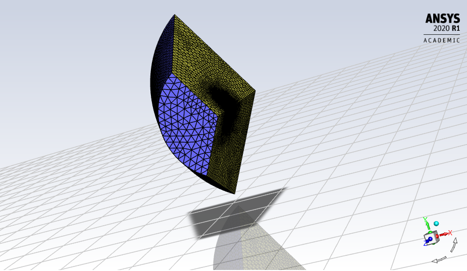
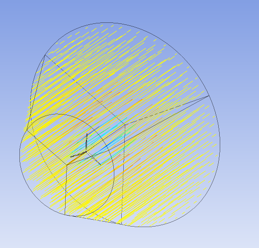
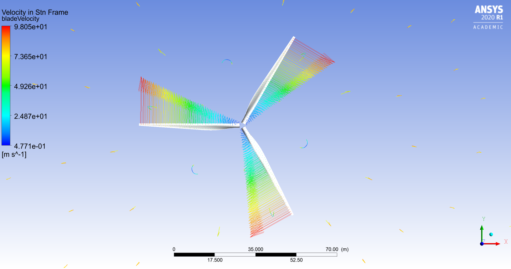
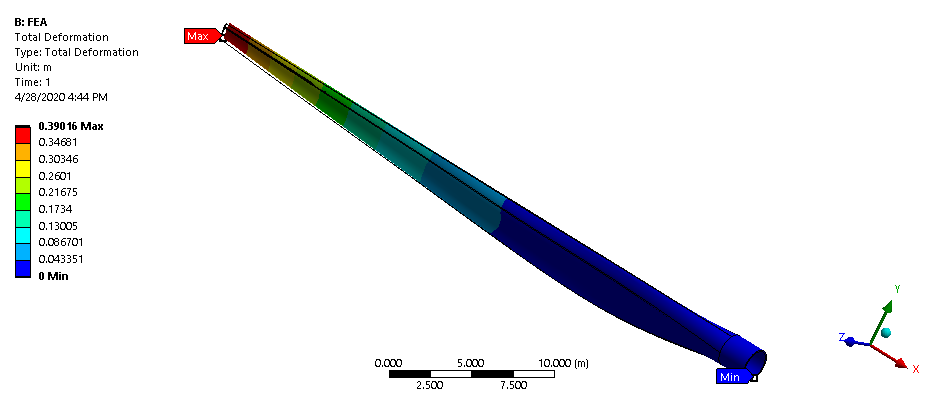

# windturbines_FEA_CFD
CFD and FEA analysis of wind turbine blades

The following represents a combined CFD and FEA analysis of a wind turbine blade. Initially, a turbulent flow study is performed on the three blades of a wind turbine using a viscous k-omega SST setup. The blades themselves are aluminum and rotate at 2.2 rad/second initially. The blades are put into a domain where air is flowing towards it at 12 m/s (43 km/hr or 26.8 mi/hr). For simplicity, one blade is generated and then mirrored three times to create a realistic environment. Altogether, the results from the CFD simulation are fed into the FEA static structural module. Here, we are able to determine the deflection and apparent stress on the blades.

#### 1/3 Mesh and complete wireframe 

### Blade Velocity

### Blade Deflection

## Built With

* [WorkBench 2020 R1](https://www.ansys.com/products/platform) - CAE simulation framework used
* [Ansys Fluent](https://www.ansys.com/products/fluids/ansys-fluent) - Fluid Flow CFD software
* [CFD-Post](https://www.ozeninc.com/products/fluid-dynamics/ansys-cfd-post/) - Results post-processor
* [Ansys Mechanical APDL Solver](https://www.ansys.com/services/training-center/structures/introduction-to-ansys-mechanical-apdl) - Mechanical Physics Solver
* [Ansys Static Structural](https://www.ansys.com/products/structures) - FEA module
